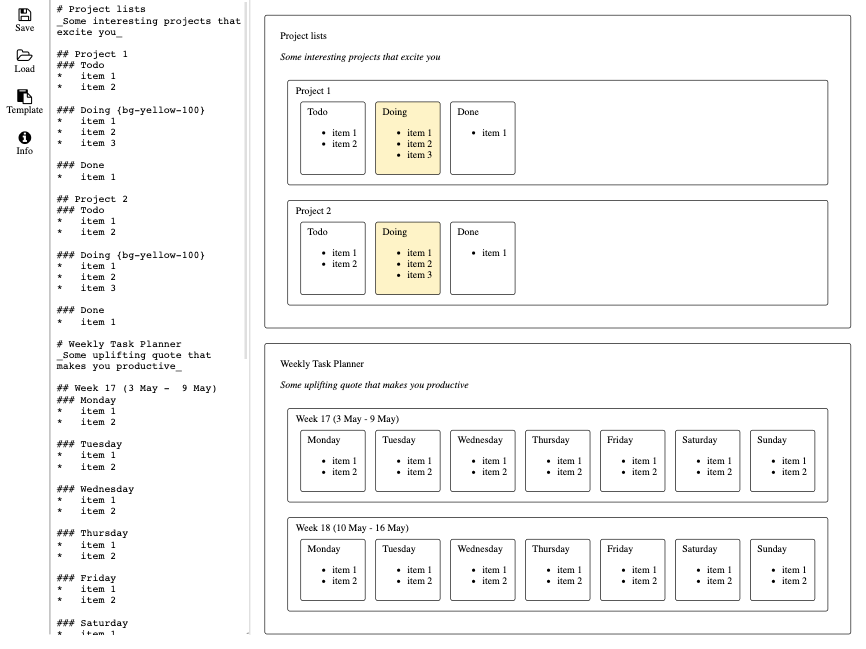

# A minimalist Markdown organiser

This is an experiment to extend Markdown's functionality without changing its syntax or forgoing its plain-text appeal. 

## Semantics

New semantics are added to headings (levels 1, 2 and 3).

*   `#` => `h1` => `Board`
*   `##` => `h2` => `Row`
*   `###` => `h3` => `Column`

where "Board", "Row" and "Column" are as shown in the following screenshot

##### Screenshot

## Features
*   All cards and items are **editable** and **movable**. **Click** to edit the text, and **Drag** to move the objects.
*   Updates are __bidirectional__. Redundant new-lines and whitespaces in the Markdown file are not preserved.
*   Support CSS classes from the [tailwind](https://tailwindcss.com/) CSS framework at the heading levels (1, 2, and 3). For example, background colour options are encoded as `bg-COLOUR-WEIGHT`, where
    - `COLOUR` can be one of {`gray, red, yellow, green, blue, indigo, purple, pink`}, and 
    - `WEIGHT` can be one of {`50, 100, 200, 300, ..., 900`}. 
    
    To use the colour, simple wrap the colour option in curly bracket and add it to the end of a heading, e.g. `# Board {bg-yellow-100}`.

## Q and A
    
*   Q. How do I copy a card?  
    A. It's Markdown, copying a card is just copying the text.
    
*   Q. Is there a search function?  
    A. It's Markdown, Ctrl / Cmd-F would work as usual.

*   Q. How is this app built?  
    A. This app is built with the R packages [sketch](https://github.com/kcf-jackson/sketch/tree/experiment) and  [shiny](https://shiny.rstudio.com/) and various JavaScript libraries  ([marked.js](https://marked.js.org/), [turndown.js](https://github.com/domchristie/turndown) and [sortable.js](https://sortablejs.github.io/Sortable/)). 

*   Q. Can I customise it?  
    A. Yes! Fork the repository and start by modifying the `styles.css` file (or even the R source code directly).
